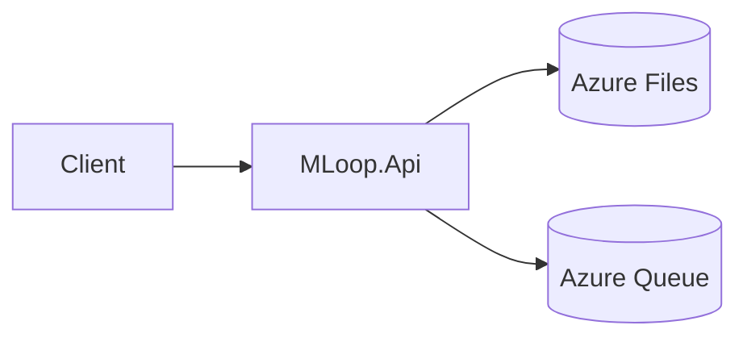
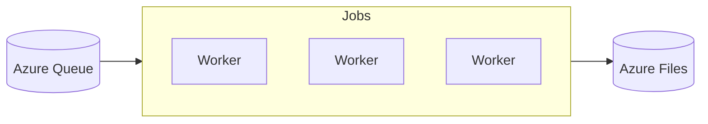
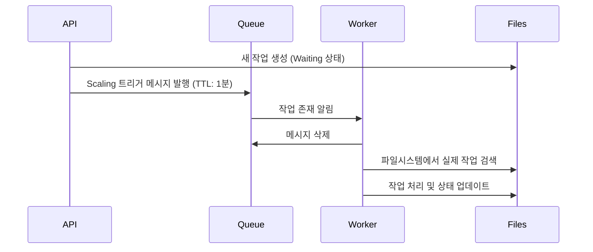

# MLoop Azure Container Apps/Jobs Architecture

## Overview

MLoop는 Azure Container Apps와 Container Jobs를 활용하여 ML 모델의 학습과 예측을 처리하는 시스템입니다.

- **MLoop.Api**: Azure Container App으로 실행
- **MLoop.Worker**: Azure Container Job으로 실행
- **Azure Queue Storage**: Worker의 Auto-scaling 트리거로 활용

## Architecture Components

### 1. MLoop.Api (Container App)

- HTTP API를 제공하여 시나리오 관리, 작업 생성, 상태 조회 등을 처리
- 파일시스템(Azure Files)을 통해 작업 상태와 메타데이터 관리
- 새로운 작업이 생성될 때 Azure Queue에 scaling 트리거 메시지 발행
- 지속적으로 실행되는 서비스로 운영



### 2. MLoop.Worker (Container Job)

- Event 트리거 타입의 Container Job으로 구성
- Azure Queue의 메시지를 scaling 트리거로 활용
- 실제 작업은 파일시스템 기반으로 처리
- 수요에 따라 0~N개의 인스턴스로 자동 확장/축소



### 3. Azure Queue Storage의 역할

Azure Queue는 **직접적인 작업 분배가 아닌 Worker의 Auto-scaling 트리거로만 활용**됩니다.

- Queue 메시지 생명주기:
  1. API가 새로운 Waiting 상태 작업 생성 시 메시지 발행
  2. TTL(Time To Live)을 1분으로 설정하여 오래된 메시지로 인한 불필요한 scaling 방지
  3. Worker가 메시지를 수신하면 즉시 삭제



### 4. 작업 처리 흐름

1. **작업 생성**:
   - API를 통해 새 작업 생성
   - 파일시스템에 작업 메타데이터 저장
   - Queue에 scaling 트리거 메시지 발행

2. **Worker Scaling**:
   - Queue에 메시지가 있으면 Azure Container Jobs가 Worker 인스턴스 시작
   - 인스턴스는 Queue Length에 따라 자동으로 확장/축소

3. **작업 처리**:
   - Worker는 큐 메시지 자체는 무시하고 파일시스템에서 작업 검색
   - `FindAndClaimNextJobAsync()`를 통해 Waiting 상태의 작업을 선점
   - 작업 처리 후 파일시스템에 결과 저장

## Deployment Configuration

### 1. Container App (MLoop.Api)

```yaml
name: mloop-api
type: Microsoft.App/containerApps
properties:
  configuration:
    ingress:
      external: true
      targetPort: 80
  template:
    containers:
    - name: api
      image: ${REGISTRY}/mloop-api:${TAG}
```

### 2. Container Job (MLoop.Worker)

```yaml
name: mloop-worker
type: Microsoft.App/jobs
properties:
  configuration:
    triggerType: Event
    replicaTimeout: 3600
    scale:
      minExecutions: 0
      maxExecutions: 10
      rules:
        - name: queue
          type: azure-queue
          metadata:
            queueName: mloop-scaling-queue
            queueLength: "1"
```

## 장점

1. **효율적인 리소스 관리**
   - 작업이 없을 때는 Worker 인스턴스가 0개로 유지
   - 작업량에 따라 자동으로 확장/축소

2. **안정성**
   - Queue는 scaling 용도로만 사용되어 Queue 장애 시에도 핵심 기능 영향 최소화
   - 파일시스템 기반의 안정적인 작업 관리 유지

3. **비용 최적화**
   - 수요기반 auto-scaling으로 불필요한 리소스 사용 방지
   - Container Job의 event-driven 특성 활용

4. **확장성**
   - 작업 유형별로 다른 Worker 풀 구성 가능
   - 처리량에 따른 유연한 scaling 지원

## 고려사항

1. **Azure Files 성능**
   - 다수의 Worker가 동시에 파일시스템에 접근할 때의 성능 고려
   - Premium 파일 공유 사용 검토

2. **작업 중복 방지**
   - Worker 간 작업 선점 시 Race Condition 방지
   - 파일시스템 기반 Lock 메커니즘 활용

3. **모니터링**
   - Container Apps/Jobs 메트릭 수집
   - Application Insights 통합
   - 작업 처리 상태 및 성능 모니터링

4. **비용**
   - Container Instance 사용량
   - Azure Files 스토리지 비용
   - Queue Storage 트랜잭션 비용